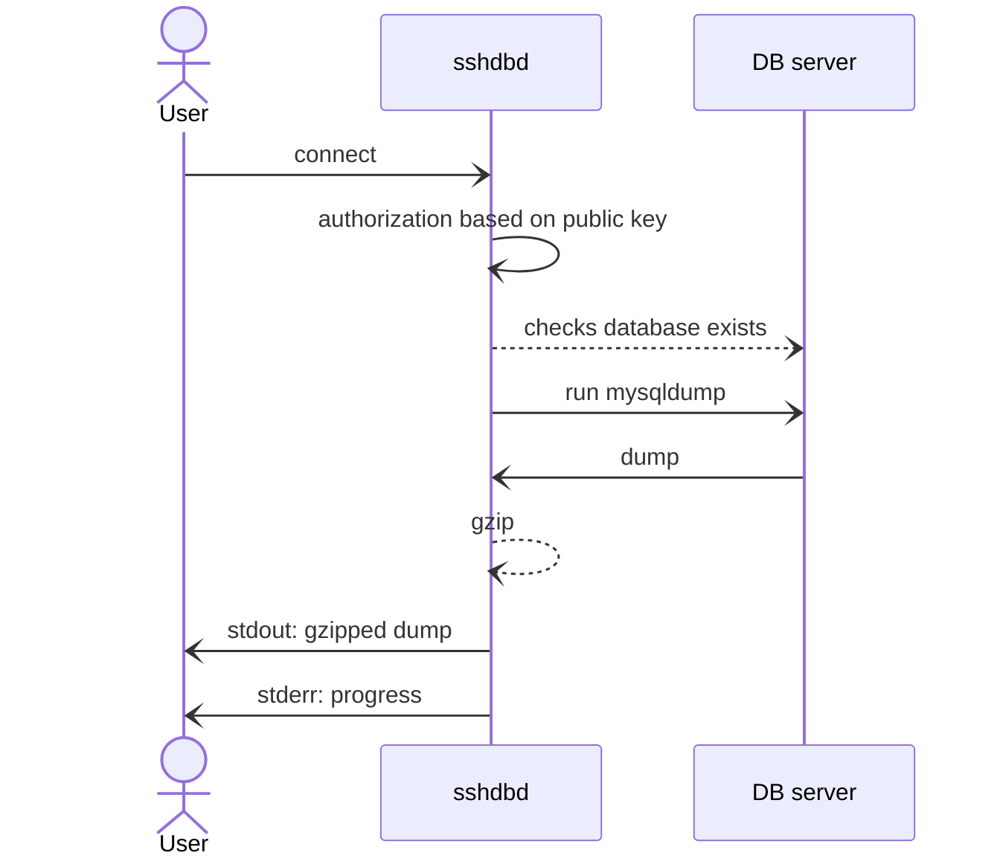

# sshdbd

Shdibbidy allows for the creation and streaming of MySQL database dumps over SSH without requiring full SSH access to the server that performs the dumping.



## Usage

```
$ ./sshdbd

NAME:
   sshdbd - A SSH server for downloading database dumps

USAGE:
   sshdbd [global options] command [command options]

COMMANDS:
   install, i  Creates the configuration directory and the required files
   serve, s    Starts the SSH server
   help, h     Shows a list of commands or help for one command

GLOBAL OPTIONS:
   --help, -h  show help
```

The program supports 2 commands: `install` and `serve`.

`install` will create a `~/.sshdbd` directory containing 3 files:
- `hostkey.pem` is the private key that will be used by the SSH server
- `authorized_keys` is the place for adding client public keys; similar to `~/.ssh/authorized_keys`
- `connections.toml` defines the database connections that are made available to clients

`serve` starts a SSH server on port `2222`. Use the `--port` option to specify a different port.

Once the server is running, clients can connect to it using a SSH command like the following:

```
ssh CONNID:DBNAME:SKIPPED_TABLES@IP -pPORT -T > dump.gz
```
where:
- CONNID is the connection ID, as specified in `connections.toml`
- DBNAME is the name of the database to be dumped
- SKIPPED_TABLES is a list of comma separated table names; these are the tables for which only the schema (not the records) will be dumped; this parameter is not required.
- the `-T` ("disable pseudo-terminal allocation") option will ensure the output is raw and the resulting database dump is not corrupted.

`stderr` will show output/progress from the server (mainly the output that `mysqldump` itself produces on `stderr`), while `stdout` will output the actual gzipped database dump, which is piped to a file in the example above.
